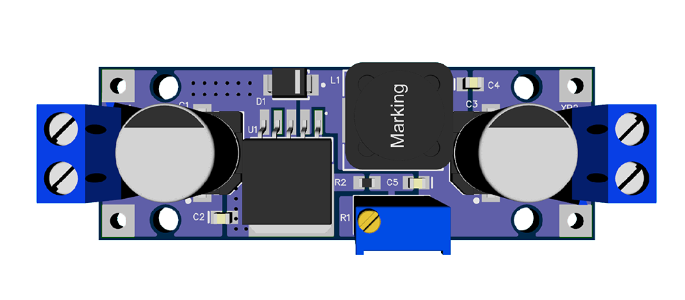
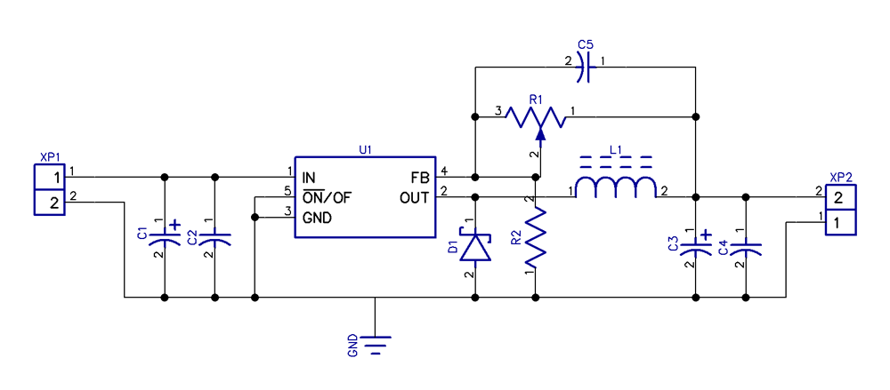

# LM2596S-ADJ
Open source LM2596S-ADJ Board, designed in DipTrace CAD.

## Schematic

## Bill of Materials

* **U1** - LM2596S-ADJ/NOPB
* **C1, C3** - CA035M0220REF-0810@YAGEO or any Electrolytic cap, surface mount / through hole, size <= 10x10mm, capacity >= 220uF, voltage => 35V
* **C2, C4** - CC0805KRX7R9BB104@YAGEO  or any Ceramic cap, surface mount, package = 0805, capacity = 0.1uF, voltage >= 50V
* **D1** - SK34, or any Schottky diode, surface mount, package = SMB (DO-214AA), voltage = 40V, current = 3A
* **R1** - 3296W-1-103LF or 3296W-103, or any Potentiometer, through hole, package = 3296W, resistance = 10kOhm
* **R2** - RC0805JR-071KL@YAGEO or any Resistor, surface mount, package = 0805, resistance = 1K
* **L1** - SRR1210-680M@BOURNS, or any Inductor, surface mount, package = SRR1210, inductance = 68uH, current = 3A
* **C5** - CC0805KRX7R9BB332@YAGEO or any Ceramic cap, surface mount, package = 0805, capacity = 3300pF, voltage >= 50V
* **XP1, XP2** - KLS2-301-5.0-02P-2S@KLSEL or DG301-5.0-02P-12
